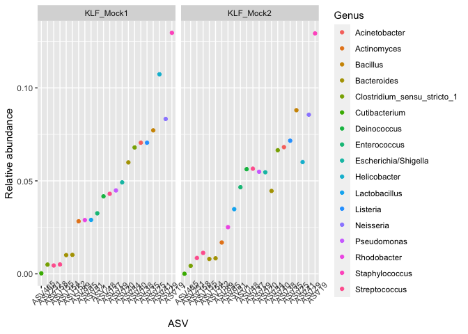

Checking read quality before cleanup
================
Lei Ma
Last compiled on 23 September, 2021

``` r
knitr::opts_chunk$set(echo = TRUE, message=FALSE, include=TRUE)
knitr::knit_hooks$set(inline = function(x) if(is.numeric(x)){format(x,digits=2)}else{x})

#misc
library(here)
```

    ## here() starts at /Users/Lei/Dropbox (MIT)/Apprill Lab/Killifish/killifish_microbiome

``` r
#data manipulations
library(tidyverse)
```

    ## ── Attaching packages ─────────────────────────────────────── tidyverse 1.3.1 ──

    ## ✓ ggplot2 3.3.5     ✓ purrr   0.3.4
    ## ✓ tibble  3.1.4     ✓ dplyr   1.0.7
    ## ✓ tidyr   1.1.3     ✓ stringr 1.4.0
    ## ✓ readr   2.0.1     ✓ forcats 0.5.1

    ## ── Conflicts ────────────────────────────────────────── tidyverse_conflicts() ──
    ## x dplyr::filter() masks stats::filter()
    ## x dplyr::lag()    masks stats::lag()

``` r
library(readr)

#plotting stuff
library(ggplot2)

#analysis
library(dada2)
```

    ## Loading required package: Rcpp

``` r
library(phyloseq)
library(decontam)
library(skimr)
```

``` r
taxonomy <- read.delim(here("output/taxonomy.txt"), "\t", header=TRUE, row.names=1, check.names = FALSE)
asvs <- read.delim(here("output/ASVs.txt"), "\t", header=TRUE, row.names=1, check.names = FALSE)
metadata <- read.delim(here("data/KLF_metadata.csv"), ",", header = TRUE, row.names=1, check.names=FALSE)
tree <- read_tree(here("output/tree.nwk"))
track <- read.delim(here("output/track.tsv"), "\t", header=TRUE, row.names=1, check.names=FALSE)
track <- mutate(track, prop.retained = nochim/reads.in) 

seqtab <- readRDS(here("output/seqtab_nochimeras.rds"))
rownames(seqtab) <- rownames(track)

mock.ref <- getSequences(here("data/HMP_MOCK.v35.fasta"))

ps <- phyloseq(otu_table(as.matrix(asvs), taxa_are_rows=TRUE),
              sample_data(as.data.frame(metadata)),
              tax_table(as.matrix(taxonomy)),
              phy_tree(tree))

ps <- merge_phyloseq(ps, sample_data(track))
metadata <- as(sample_data(ps), 'data.frame')
```

## Raw data / run summary

Making sure that the two sequencing runs are not too different from each
other. In general it seems like Run2 had a higher proportion of reads
pass filter but not more overall reads

``` r
metadata %>% ggplot(aes(x=nochim, y=prop.retained, color=sequencingRun))+geom_point()+labs(x="Reads pass filter", y="Proportion pass filter")
```

<!-- -->

## Mock community check

Next we check that the Mock community is well covered in both runs.
Mock1 is from Run1 and Mock2 is from Run2. Looks like there’s very low
contamination of other sequences in the mock samples. However, there is
some slight difference in the ordering of mock abundances, but this
variation is similar to previous runs.

``` r
match.mock <- sapply(names(seqtab[1,]), function(x) any(grepl(x, c(mock.ref))))
match.mock <- rownames(taxonomy[match.mock,])
ps.mock <- ps %>% subset_samples(sampleType=="mock") %>% prune_taxa(taxa_sums(.)>0, .) %>% transform_sample_counts(function(x) x/sum(x)) %>% psmelt()
ps.mock <- ps.mock %>% bind_cols(correct=sapply(ps.mock$OTU, function(x) if(x %in% match.mock){return("Correct")}else{return("Wrong")}))

ps.mock %>% select(OTU, sample, Abundance, correct) %>% group_by(sample, correct) %>% summarise(proportion = sum(Abundance)) %>% pivot_wider(id_cols=sample, values_from = proportion, names_from=correct)
```

    ## # A tibble: 2 × 3
    ## # Groups:   sample [2]
    ##   sample    Correct     Wrong
    ##   <chr>       <dbl>     <dbl>
    ## 1 KLF_Mock1   0.999 0.00110  
    ## 2 KLF_Mock2   1.00  0.0000472

``` r
ps.mock %>% filter(OTU %in% match.mock) %>% ggplot(aes(x=reorder(OTU, Abundance), y=Abundance, color=Genus)) + geom_point() + facet_wrap(~sample) + theme(axis.text.x = element_text(angle=45)) + labs(x="ASV", y="Relative abundance")
```

<!-- -->

Now that mock is checked out, we can remove it from the data.

``` r
ps <- ps %>% subset_samples(sampleType != "mock") %>% prune_taxa(taxa_sums(.)>0,.)
```

## Removing ASVs with decontam

We will use decontam and the negative controls (both extraction
negatives and pcr negatives) to filter out potential contaminant
sequences by frequency of appearance in the negative controls.

``` r
sample_data(ps)$is.neg <- grepl("control", sample_data(ps)$sampleType)
contamdf.prev <- isContaminant(ps, method="prevalence", neg="is.neg")
table(contamdf.prev$contaminant)
```

    ## 
    ## FALSE  TRUE 
    ## 11676    62

Below is the taxonomy of the ASVs that were identified as contaminants.

``` r
contaminant_asvs <- rownames(contamdf.prev[which(contamdf.prev$contaminant),])
taxonomy[contaminant_asvs,]
```

    ##          Kingdom           Phylum               Class
    ## ASV283  Bacteria   Proteobacteria Alphaproteobacteria
    ## ASV966  Bacteria   Proteobacteria Alphaproteobacteria
    ## ASV752  Bacteria   Proteobacteria Alphaproteobacteria
    ## ASV5290 Bacteria Actinobacteriota      Actinobacteria
    ## ASV861  Bacteria Actinobacteriota      Actinobacteria
    ## ASV169  Bacteria Actinobacteriota      Actinobacteria
    ## ASV1193 Bacteria Actinobacteriota      Actinobacteria
    ## ASV492  Bacteria Actinobacteriota      Actinobacteria
    ## ASV485  Bacteria Actinobacteriota      Actinobacteria
    ## ASV630  Bacteria     Deinococcota          Deinococci
    ## ASV874  Bacteria    Cyanobacteria      Cyanobacteriia
    ## ASV890  Bacteria   Fusobacteriota       Fusobacteriia
    ## ASV3528 Bacteria   Fusobacteriota       Fusobacteriia
    ## ASV2065 Bacteria       Firmicutes          Clostridia
    ## ASV322  Bacteria       Firmicutes          Clostridia
    ## ASV2038 Bacteria       Firmicutes             Bacilli
    ## ASV51   Bacteria       Firmicutes             Bacilli
    ## ASV1457 Bacteria       Firmicutes             Bacilli
    ## ASV2851 Bacteria       Firmicutes             Bacilli
    ## ASV19   Bacteria       Firmicutes             Bacilli
    ## ASV464  Bacteria       Firmicutes             Bacilli
    ## ASV2251 Bacteria       Firmicutes             Bacilli
    ## ASV74   Bacteria       Firmicutes             Bacilli
    ## ASV379  Bacteria       Firmicutes             Bacilli
    ## ASV316  Bacteria       Firmicutes             Bacilli
    ## ASV2326 Bacteria       Firmicutes       Negativicutes
    ## ASV4175 Bacteria   Proteobacteria                <NA>
    ## ASV1270 Bacteria   Proteobacteria Alphaproteobacteria
    ## ASV474  Bacteria   Proteobacteria Alphaproteobacteria
    ## ASV1350 Bacteria   Proteobacteria Alphaproteobacteria
    ## ASV1372 Bacteria   Proteobacteria Alphaproteobacteria
    ## ASV175  Bacteria   Proteobacteria Alphaproteobacteria
    ## ASV633  Bacteria   Proteobacteria Alphaproteobacteria
    ## ASV4363 Bacteria     Bacteroidota         Bacteroidia
    ## ASV138  Bacteria     Bacteroidota         Bacteroidia
    ## ASV4176 Bacteria     Bacteroidota         Bacteroidia
    ## ASV916  Bacteria     Bacteroidota         Bacteroidia
    ## ASV4268 Bacteria   Proteobacteria Gammaproteobacteria
    ## ASV431  Bacteria   Proteobacteria Gammaproteobacteria
    ## ASV258  Bacteria   Proteobacteria Gammaproteobacteria
    ## ASV3377 Bacteria   Proteobacteria Gammaproteobacteria
    ## ASV335  Bacteria   Proteobacteria Gammaproteobacteria
    ## ASV1488 Bacteria   Proteobacteria Gammaproteobacteria
    ## ASV2930 Bacteria   Proteobacteria Gammaproteobacteria
    ## ASV39   Bacteria   Proteobacteria Gammaproteobacteria
    ## ASV1112 Bacteria   Proteobacteria Gammaproteobacteria
    ## ASV105  Bacteria   Proteobacteria Gammaproteobacteria
    ## ASV2151 Bacteria   Proteobacteria Gammaproteobacteria
    ## ASV186  Bacteria   Proteobacteria Gammaproteobacteria
    ## ASV55   Bacteria   Proteobacteria Gammaproteobacteria
    ## ASV214  Bacteria   Proteobacteria Gammaproteobacteria
    ## ASV465  Bacteria   Proteobacteria Gammaproteobacteria
    ## ASV81   Bacteria   Proteobacteria Gammaproteobacteria
    ## ASV36   Bacteria   Proteobacteria Gammaproteobacteria
    ## ASV7    Bacteria   Proteobacteria Gammaproteobacteria
    ## ASV198  Bacteria   Proteobacteria Gammaproteobacteria
    ## ASV58   Bacteria   Proteobacteria Gammaproteobacteria
    ## ASV2442 Bacteria   Proteobacteria Gammaproteobacteria
    ## ASV971  Bacteria   Proteobacteria Alphaproteobacteria
    ## ASV161  Bacteria   Proteobacteria Alphaproteobacteria
    ## ASV326  Bacteria   Proteobacteria Alphaproteobacteria
    ## ASV428  Bacteria   Proteobacteria Alphaproteobacteria
    ##                                      Order                 Family
    ## ASV283                         Rhizobiales      Xanthobacteraceae
    ## ASV966                         Rhizobiales       Beijerinckiaceae
    ## ASV752                     Caulobacterales       Caulobacteraceae
    ## ASV5290                      Micrococcales         Micrococcaceae
    ## ASV861                   Corynebacteriales       Mycobacteriaceae
    ## ASV169                   Corynebacteriales     Corynebacteriaceae
    ## ASV1193                  Corynebacteriales     Corynebacteriaceae
    ## ASV492                 Propionibacteriales        Nocardioidaceae
    ## ASV485                 Propionibacteriales   Propionibacteriaceae
    ## ASV630                           Thermales             Thermaceae
    ## ASV874                         Chloroplast                   <NA>
    ## ASV890                     Fusobacteriales       Leptotrichiaceae
    ## ASV3528                    Fusobacteriales       Fusobacteriaceae
    ## ASV2065                      Clostridiales         Oxobacteraceae
    ## ASV322                       Clostridia_or Hungateiclostridiaceae
    ## ASV2038                    Lactobacillales       Leuconostocaceae
    ## ASV51                      Lactobacillales       Lactobacillaceae
    ## ASV1457                    Lactobacillales       Streptococcaceae
    ## ASV2851                   Staphylococcales            Gemellaceae
    ## ASV19                     Staphylococcales      Staphylococcaceae
    ## ASV464                          Bacillales         Planococcaceae
    ## ASV2251                         Bacillales         Planococcaceae
    ## ASV74                           Bacillales  Sporolactobacillaceae
    ## ASV379                          Bacillales            Bacillaceae
    ## ASV316                          Bacillales  Sporolactobacillaceae
    ## ASV2326     Veillonellales-Selenomonadales        Veillonellaceae
    ## ASV4175                               <NA>                   <NA>
    ## ASV1270                      Rickettsiales           Mitochondria
    ## ASV474                       Rickettsiales           Mitochondria
    ## ASV1350                      Rickettsiales           Mitochondria
    ## ASV1372                      Rickettsiales           Mitochondria
    ## ASV175                       Rickettsiales           Mitochondria
    ## ASV633                       Rickettsiales           Mitochondria
    ## ASV4363                    Chitinophagales       Chitinophagaceae
    ## ASV138                    Flavobacteriales          Weeksellaceae
    ## ASV4176                   Flavobacteriales      Flavobacteriaceae
    ## ASV916                     Chitinophagales         Saprospiraceae
    ## ASV4268                    Cellvibrionales       Cellvibrionaceae
    ## ASV431                     Alteromonadales       Alteromonadaceae
    ## ASV258                     Pseudomonadales       Pseudomonadaceae
    ## ASV3377                    Pseudomonadales       Pseudomonadaceae
    ## ASV335                     Pseudomonadales       Pseudomonadaceae
    ## ASV1488                    Pseudomonadales       Pseudomonadaceae
    ## ASV2930                    Pseudomonadales       Pseudomonadaceae
    ## ASV39                      Cellvibrionales       Cellvibrionaceae
    ## ASV1112 Gammaproteobacteria_Incertae_Sedis         Unknown_Family
    ## ASV105                     Burkholderiales         Comamonadaceae
    ## ASV2151                    Burkholderiales         Comamonadaceae
    ## ASV186                     Burkholderiales       Burkholderiaceae
    ## ASV55                      Burkholderiales         Alcaligenaceae
    ## ASV214                     Burkholderiales          Neisseriaceae
    ## ASV465                    Enterobacterales           Yersiniaceae
    ## ASV81                     Enterobacterales           Yersiniaceae
    ## ASV36                     Enterobacterales           Yersiniaceae
    ## ASV7                       Pseudomonadales          Moraxellaceae
    ## ASV198                     Pseudomonadales          Moraxellaceae
    ## ASV58                      Xanthomonadales       Xanthomonadaceae
    ## ASV2442                    Xanthomonadales       Xanthomonadaceae
    ## ASV971                     Caulobacterales        Hyphomonadaceae
    ## ASV161                         Rhizobiales           Rhizobiaceae
    ## ASV326                         Rhizobiales           Rhizobiaceae
    ## ASV428                     Rhodobacterales       Rhodobacteraceae
    ##                      Genus                                         Species
    ## ASV283      Bradyrhizobium                                            <NA>
    ## ASV966               Bosea                                            <NA>
    ## ASV752       Brevundimonas                    albigilva/nasdae/vesicularis
    ## ASV5290             Rothia                                    dentocariosa
    ## ASV861       Mycobacterium                                            <NA>
    ## ASV169          Lawsonella                                  clevelandensis
    ## ASV1193    Corynebacterium aurimucosum/pseudogenitalium/tuberculostearicum
    ## ASV492        Nocardioides                                        jensenii
    ## ASV485       Cutibacterium                                    acnes/avidum
    ## ASV630             Thermus                   amyloliquefaciens/scotoductus
    ## ASV874                <NA>                                            <NA>
    ## ASV890        Leptotrichia                                    shahii/wadei
    ## ASV3528      Fusobacterium                                       nucleatum
    ## ASV2065          Oxobacter                                            <NA>
    ## ASV322   Ruminiclostridium                                            <NA>
    ## ASV2038        Leuconostoc                                            <NA>
    ## ASV51        Lactobacillus                                            <NA>
    ## ASV1457      Streptococcus                           anginosus/intermedius
    ## ASV2851            Gemella                                            <NA>
    ## ASV19       Staphylococcus                                            <NA>
    ## ASV464         Planococcus                                            <NA>
    ## ASV2251         Chungangia                                            <NA>
    ## ASV74   Sporolactobacillus                                            <NA>
    ## ASV379                <NA>                                            <NA>
    ## ASV316  Terrilactibacillus                                   laevilacticus
    ## ASV2326        Veillonella                                         parvula
    ## ASV4175               <NA>                                            <NA>
    ## ASV1270               <NA>                                            <NA>
    ## ASV474                <NA>                                            <NA>
    ## ASV1350               <NA>                                            <NA>
    ## ASV1372               <NA>                                            <NA>
    ## ASV175                <NA>                                            <NA>
    ## ASV633                <NA>                                            <NA>
    ## ASV4363      Vibrionimonas                                            <NA>
    ## ASV138     Cloacibacterium                        caeni/normanense/rupense
    ## ASV4176       Zunongwangia                                            <NA>
    ## ASV916         Portibacter                                            <NA>
    ## ASV4268         Cellvibrio                                            <NA>
    ## ASV431          Glaciecola                                            <NA>
    ## ASV258         Pseudomonas                                            <NA>
    ## ASV3377        Pseudomonas                                            <NA>
    ## ASV335         Pseudomonas                                            <NA>
    ## ASV1488        Pseudomonas                                            <NA>
    ## ASV2930        Pseudomonas                                            <NA>
    ## ASV39                 <NA>                                            <NA>
    ## ASV1112        Acidibacter                                            <NA>
    ## ASV105             Delftia                                            <NA>
    ## ASV2151         Acidovorax                                            <NA>
    ## ASV186           Ralstonia                                            <NA>
    ## ASV55        Achromobacter                                            <NA>
    ## ASV214           Neisseria                             flavescens/perflava
    ## ASV465            Yersinia                                            <NA>
    ## ASV81                 <NA>                                            <NA>
    ## ASV36             Serratia                                            <NA>
    ## ASV7         Acinetobacter                                            <NA>
    ## ASV198       Enhydrobacter                                            <NA>
    ## ASV58     Stenotrophomonas                                     maltophilia
    ## ASV2442   Stenotrophomonas                                            <NA>
    ## ASV971                <NA>                                            <NA>
    ## ASV161       Mesorhizobium                                    huakuii/loti
    ## ASV326       Pseudahrensia                                            <NA>
    ## ASV428   Yoonia-Loktanella                                            <NA>

Here’s a graph of the ASV prevalence in true vs negative control
samples. Highlighed in blue are the ones identified as contaminants.

``` r
ps.pa <- transform_sample_counts(ps, function(abund) 1*(abund>0))
ps.pa.neg <- prune_samples(sample_data(ps.pa)$is.neg == TRUE, ps.pa)
ps.pa.pos <- prune_samples(sample_data(ps.pa)$is.neg != TRUE, ps.pa)
# Make data.frame of prevalence in positive and negative samples
df.pa <- data.frame(pa.pos=taxa_sums(ps.pa.pos), pa.neg=taxa_sums(ps.pa.neg),
                      contaminant=contamdf.prev$contaminant)
ggplot(data=df.pa, aes(x=pa.neg, y=pa.pos, color=contaminant)) + geom_point() +
  xlab("Prevalence (Negative Controls)") + ylab("Prevalence (True Samples)")
```

<!-- -->

## Chloroplasts

I also want to remove the chloroplasts from the samples. However, I want
to make a record of the chloroplast abundance in the metadata of the
sample, because it may be useful information later.

``` r
ps.chloroplast <- ps %>% transform_sample_counts(function(x) x/sum(x)) %>% subset_taxa(Order=="Chloroplast") %>% psmelt() %>% select(OTU, sample, Abundance)
ps.chloroplast <- ps.chloroplast %>% group_by(sample) %>% summarise(chl_abundance=sum(Abundance)) %>% column_to_rownames("sample")

ps <- merge_phyloseq(ps, sample_data(ps.chloroplast))

ggplot(sample_data(ps), aes(x=reorder(sample, chl_abundance), y=chl_abundance, color=sampleType)) + geom_point() + facet_wrap(~site, scales="free_x") + labs(title="Proportion of reads matching Order Chloroplast", x="Sample", y="Chloroplast relative abundance")
```

<!-- -->
Removing chloroplasts, contaminants, and non-bacterial/archaeal ASVs How
do the read counts look after we remove the chloroplast samples and the
putative contaminants?

``` r
# remove contaminants
ps <- prune_taxa(!taxa_names(ps) %in% contaminant_asvs, ps)

# remove chloroplasts and Eukaryotess
ps <- subset_taxa(ps, Kingdom!="Eukaryota") %>% subset_taxa(Order!="Chloroplast" | is.na(Order))

# remove controls
ps <- subset_samples(ps, sampleType %in% c("gut", "water")) %>% prune_taxa(taxa_sums(.)>0,.)

# get number and proportion of reads now
sample_data(ps)$reads.clean <- sample_sums(ps)
sample_data(ps)$final.prop <- sample_data(ps)$reads.clean/sample_data(ps)$reads.in
```

## Cleaned up stats

In the table below nochim is the number of raw reads passed dada2
filtering. prop.retained is the proportion passed dada2 filtering.
reads.clean is the number of reads we currently have and final.prop is
the final proportion of reads pass all the filtering (dada2 and what we
just did)

``` r
read_stats <- sample_data(ps) %>% as_tibble() %>% select(sample, nochim, prop.retained, reads.clean, final.prop) %>% skim(where(is.numeric))
tibble(read_stats)
```

    ## # A tibble: 4 × 12
    ##   skim_type skim_variable n_missing complete_rate numeric.mean numeric.sd
    ##   <chr>     <chr>             <int>         <dbl>        <dbl>      <dbl>
    ## 1 numeric   nochim                0             1    91698.    24049.    
    ## 2 numeric   prop.retained         0             1        0.773     0.0725
    ## 3 numeric   reads.clean           0             1    84819.    26271.    
    ## 4 numeric   final.prop            0             1        0.712     0.120 
    ## # … with 6 more variables: numeric.p0 <dbl>, numeric.p25 <dbl>,
    ## #   numeric.p50 <dbl>, numeric.p75 <dbl>, numeric.p100 <dbl>,
    ## #   numeric.hist <chr>

The script preprocessing.R will generate the cleaned data that will be
used in the subsequence notebooks.
