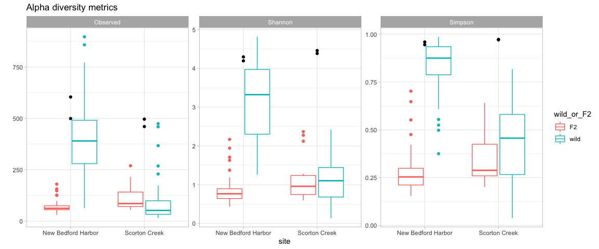

Exploring alpha and beta diversity
================
Lei Ma
Last compiled on 01 October, 2021

``` r
ps <- readRDS(here("data/processed/ps.rds"))
ps.rel <- readRDS(here("data/processed/psrel.rds"))
```

## Alpha diversity

Comparing wild and F2 killifish alpha diversity. Black dots represent
the water at each site at the time of sampling. Water for the captive
killifish is not available.

``` r
p <- ps %>% subset_samples(sampleType=="gut") %>% plot_richness(x = "site", measures=c("Observed","Shannon","Simpson"))
w <- ps %>% subset_samples(sampleType=="water") %>% plot_richness(x = "site", measures=c("Observed","Shannon","Simpson"))
ggplot(p$data, aes(x=site, y=value, color=wild_or_F2)) + geom_boxplot() + geom_point(data=w$data, aes(x=site, y=value), color="black") + facet_wrap(~variable, scales="free_y") + theme_light() + labs(title="Alpha diversity metrics", y="")
```

<!-- -->

## PCoA of all samples

I attempted to do an NMDS ordination but `metaMDS` would not converge.
So I created a PCoA using Bray-Curtis dissimilarity

``` r
ps.rel.bc <- distance(ps.rel, method="bray")
ps.rel.bc.pcoa <- ordinate(ps.rel, method="MDS", distance=ps.rel.bc)
```

``` r
p <- plot_ordination(ps.rel, ps.rel.bc.pcoa) + 
  geom_point(aes(color=site, shape=wild_or_F2), size=4) +
  labs(title="PCoA using Bray Curtis Dissimilarity") +
  theme_light()

# coordinates are fixed to the sqrt of the second eigenvalue divided by the first eigenvalue
p + 
  geom_point(data=p$data %>% filter(sampleType=="water"), aes(x=Axis.1, y=Axis.2, color=site), shape="circle", size=4) + 
  scale_color_manual(name="Site", values=c("pink", "blue")) +
  scale_shape_manual(name="Sample/Fish Type", values=c("square", "circle", "triangle"),labels=c("F2", "Water", "Wild")) +
  coord_fixed(sqrt(ps.rel.bc.pcoa$values[,1][2]/ps.rel.bc.pcoa$values[,1][1]))
```

<!-- -->

## Beta dispersion

Subsetting to just the gut samples, now we look at the beta
dispersion/diversity between sites and between F2 and wild type

``` r
ps.rel.gut <- ps.rel %>% subset_samples(sampleType=="gut")
ps.rel.gut.dist <- distance(ps.rel.gut, "bray")
dat <- as(sample_data(ps.rel.gut), "data.frame")

fishType <- dat$fishType
site <- dat$site
wild_or_F2 <- dat$wild_or_F2

# Check the beta dispersion of site X wild_or_F2
disper.fishType <- betadisper(d=ps.rel.gut.dist, group=fishType)
df <- data.frame(disper=disper.fishType$distances,group=disper.fishType$group)
disper_plot<-ggplot(df, aes(x=group, y=disper)) + geom_boxplot(aes(color=group)) + 
  labs(y="Distance from spatial media") +coord_flip() + scale_x_discrete(limits=rev) + 
  theme_light() + theme(axis.title.y.left = element_blank(), legend.position = "none")
disper_plot
```

<!-- -->

Tukey’s HSD test shows that all pairwise comparisons of beta dispersion
between fish types are significantly different except for between the F2
fish.

``` r
tuk.fishType <- TukeyHSD(disper.fishType)
tuk.fishType
```

    ##   Tukey multiple comparisons of means
    ##     95% family-wise confidence level
    ## 
    ## Fit: aov(formula = distances ~ group, data = df)
    ## 
    ## $group
    ##                                                      diff         lwr
    ## New Bedford Harbor F2-New Bedford Harbor wild -0.53786755 -0.62046310
    ## Scorton Creek wild-New Bedford Harbor wild    -0.25980136 -0.34434061
    ## Scorton Creek F2-New Bedford Harbor wild      -0.50574551 -0.62021219
    ## Scorton Creek wild-New Bedford Harbor F2       0.27806619  0.19547063
    ## Scorton Creek F2-New Bedford Harbor F2         0.03212203 -0.08091673
    ## Scorton Creek F2-Scorton Creek wild           -0.24594415 -0.36041083
    ##                                                      upr     p adj
    ## New Bedford Harbor F2-New Bedford Harbor wild -0.4552720 0.0000000
    ## Scorton Creek wild-New Bedford Harbor wild    -0.1752621 0.0000000
    ## Scorton Creek F2-New Bedford Harbor wild      -0.3912788 0.0000000
    ## Scorton Creek wild-New Bedford Harbor F2       0.3606617 0.0000000
    ## Scorton Creek F2-New Bedford Harbor F2         0.1451608 0.8810824
    ## Scorton Creek F2-Scorton Creek wild           -0.1314775 0.0000007
