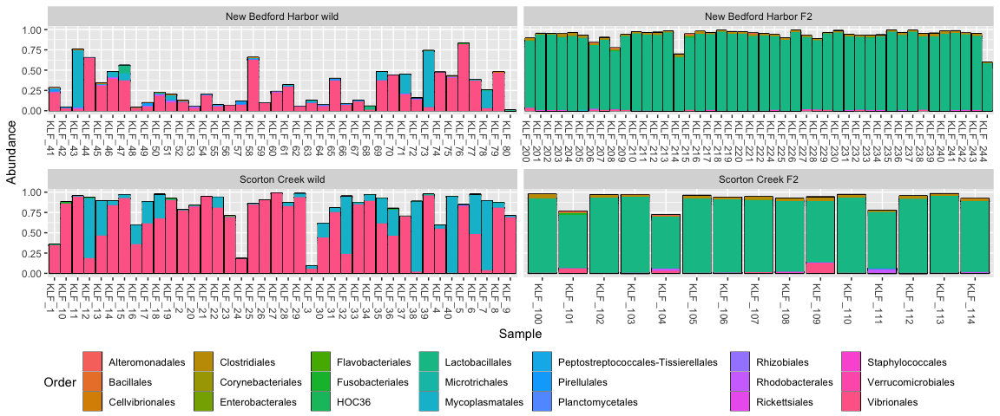

ASV differences between wild and F2
================
Lei Ma
Last compiled on 30 September, 2021

    ## here() starts at /Users/Lei/Dropbox (MIT)/Apprill Lab/Killifish/killifish_microbiome

    ## ── Attaching packages ─────────────────────────────────────── tidyverse 1.3.1 ──

    ## ✓ ggplot2 3.3.5     ✓ purrr   0.3.4
    ## ✓ tibble  3.1.4     ✓ dplyr   1.0.7
    ## ✓ tidyr   1.1.3     ✓ stringr 1.4.0
    ## ✓ readr   2.0.1     ✓ forcats 0.5.1

    ## ── Conflicts ────────────────────────────────────────── tidyverse_conflicts() ──
    ## x dplyr::filter() masks stats::filter()
    ## x dplyr::lag()    masks stats::lag()

    ## Loading required package: permute

    ## Loading required package: lattice

    ## This is vegan 2.5-7

    ## Loading required package: grid

    ## Loading required package: futile.logger

``` r
ps <- readRDS(here("data/processed/ps.rds"))
ps.rel <- readRDS(here("data/processed/psrel.rds"))
ps.rel.melted <- readRDS(here("data/processed/psrelmelted.rds"))
```

## Overlap of ASVs

I was curious how many ASVs were unique to each environment/fish type:
Scorton Creek wild, New Bedford Harbor wild, and the respective F2 fish

``` r
taxa_list <- list(sc_w = subset_samples(ps, fishType=="Scorton Creek wild") %>% prune_taxa(taxa_sums(.)>0,.) %>% taxa_names(),
                  nb_w = subset_samples(ps, fishType=="New Bedford Harbor wild") %>% prune_taxa(taxa_sums(.)>0,.) %>% taxa_names(),
                  sc_f2 = subset_samples(ps, fishType=="Scorton Creek F2") %>% prune_taxa(taxa_sums(.)>0,.) %>% taxa_names(),
                  nb_f2 = subset_samples(ps, fishType=="New Bedford Harbor F2") %>% prune_taxa(taxa_sums(.)>0,.) %>% taxa_names())

taxa_overlap <- calculate.overlap(taxa_list)

venn.diagram(taxa_list, filename = here("figures/Venn_gut.tiff"), imagetype="tiff", main="Venn diagram of taxa shared between fish types")
```

    ## [1] 1

``` r
knitr::include_graphics(here("figures/Venn_gut.tiff"))
```

/Apprill%20Lab/Killifish/killifish_microbiome/figures/Venn_gut.tiff)<!-- -->
\#\# “Core taxa” present in all fish types

Core taxa in wild type are either Vibrionaceae or Mycoplasma while core
taxa in F2 are Enterococcus

``` r
ps.core <- prune_taxa(taxa_names(ps.rel) %in% taxa_overlap$a6, ps.rel) %>% subset_samples(sampleType=="gut")
core.plot <- ps.core %>% plot_bar(fill="Order")+ geom_bar(aes(fill=Order), stat="identity", position="stack")+facet_wrap(~fishType, scales="free_x")
core.plot
```

<!-- -->

Are the vibrios/mycoplasmatales and enterococcus negative associated
with each other within wild types and F2s? Or is it just that
enterococcus overtook the vibrios? Analysis TBD. Maybe with heatmaps?
