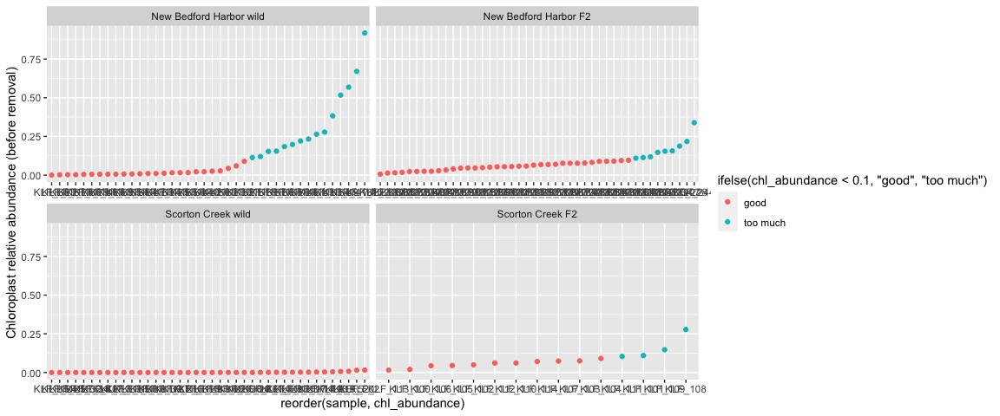

Which fish to do metagenomics on?
================
Lei Ma
Last compiled on 01 October, 2021

``` r
ps <- readRDS(here("data/processed/ps.rds"))
ps.rel <- readRDS(here("data/processed/psrel.rds"))
metadata <- read.delim(here("data/processed/metadata.csv"), ",", header = TRUE, row.names=1, check.names=FALSE)
taxonomy <- read.delim(here("data/processed/taxonomy.txt"), "\t", header=TRUE, row.names = 1, check.names=FALSE)
```

## Criteria

Criteria for good metagenomics candidates:

-   Few chloroplast sequences
-   male fish only in case of sex effect
-   Representative host genotypes, as determined by PCR with RF1 and IR1
    reverse primers
-   Low and high diversity guts from NBH wild fish

## Chloroplasts

Looks like there’s plenty of choice if we filter out fish with
chloroplast abundance less than 10%

``` r
ggplot(sample_data(ps) %>% subset_samples(sampleType=="gut"), aes(x=reorder(sample, chl_abundance), y=chl_abundance, color=ifelse(chl_abundance<0.1, "good", "too much")))+geom_point()+facet_wrap(~fishType, scales="free_x") + labs(y="Chloroplast relative abundance (before removal)")
```

<!-- -->

## Host genotypes

Let’s look at the distribution of host genotypes. I think it’s
interesting that the distribution of genotypes is so similar for the
wild fish but different in the F2 that were common garden raised. Fish
with genotype “none” did not have a band wither either set of primer. I
have re-extracted DNA and re-run the primers for the wild fish, which
decreased the number of “none” genotypes, but have not done so yet for
the F2 fish, hence the greater number of “none” fish in F2.

``` r
ggplot(metadata %>% filter(!is.na(genotype) & sampleType=="gut"), aes(x=genotype)) + geom_bar(position="stack") +facet_wrap(~fishType) + labs("Distribution of genotypes before removing high chloroplast fish") + geom_text(stat='count', aes(label=..count..), vjust=1, color="yellow")
```

<!-- -->

## Variability

NBH fish were highly variable in the microbiome composition, but some
were more variable than others. As an example, here are the most and
least even of the NBH fish. So we could potentially select 3 most and
least even (in terms of shannon diversity or some other metric) NBH
fish.

``` r
nbh_w_shannon <- ps %>% subset_samples(fishType=="New Bedford Harbor wild") %>% estimate_richness(measures = "Shannon") %>% arrange(Shannon) %>% rownames_to_column(var="sample")

extremes <- c(nbh_w_shannon[1:3,1],nbh_w_shannon[38:40,1])

# get the top 10 Orders
p.order <- ps.rel %>% subset_samples(sample %in% extremes) %>% speedyseq::tax_glom("Order") %>% taxa_sums() %>% sort(TRUE) %>% names() %>% .[1:10] %>% taxonomy[.,4]

p <- ps.rel %>% subset_samples(sample %in% extremes) %>% prune_taxa(taxa_sums(.)>0,.) %>% plot_bar()
p + geom_bar(data=p$data %>% filter(Order %in% p.order), aes(fill=Order), position="stack", stat="identity")+guides(fill=guide_legend(title="Order"))+ labs(title="Top 10 Orders (others in grey)", subtitle = "The 3 lowest vs 3 highest Shannon diversity NBH wild fish")
```

<!-- -->
