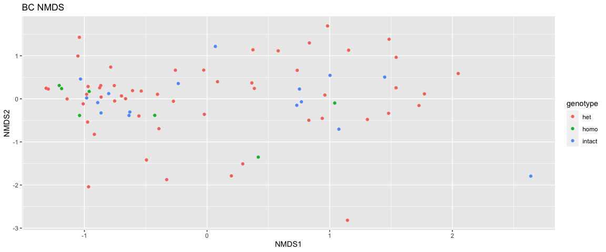

Host genotype effects
================
Lei Ma
Last compiled on 01 October, 2021

``` r
ps <- readRDS(here("data/processed/ps.rds"))
ps.rel <- readRDS(here("data/processed/psrel.rds"))
metadata <- read.delim(here("data/processed/metadata.csv"), ",", header = TRUE, row.names=1, check.names=FALSE)
```

## Wild fish microbiome correlation with genotype

Not looking great visually

``` r
ps.rel.filtered <- ps.rel %>% subset_samples(wild_or_F2=="wild" & sampleType=="gut" & genotype != "none") %>% prune_taxa(taxa_sums(.)>0,.)
p.ord <- ordinate(ps.rel.filtered, method="NMDS", distance = "bray", trymax=500)
```

    ## Run 0 stress 0.2094239 
    ## Run 1 stress 0.2073471 
    ## ... New best solution
    ## ... Procrustes: rmse 0.05784852  max resid 0.2106991 
    ## Run 2 stress 0.240506 
    ## Run 3 stress 0.2051364 
    ## ... New best solution
    ## ... Procrustes: rmse 0.02978806  max resid 0.2084704 
    ## Run 4 stress 0.2359476 
    ## Run 5 stress 0.2093122 
    ## Run 6 stress 0.2076095 
    ## Run 7 stress 0.20736 
    ## Run 8 stress 0.2061756 
    ## Run 9 stress 0.2301794 
    ## Run 10 stress 0.2130472 
    ## Run 11 stress 0.2092656 
    ## Run 12 stress 0.2394765 
    ## Run 13 stress 0.2093086 
    ## Run 14 stress 0.2312277 
    ## Run 15 stress 0.235774 
    ## Run 16 stress 0.2068711 
    ## Run 17 stress 0.2336881 
    ## Run 18 stress 0.2074035 
    ## Run 19 stress 0.2144285 
    ## Run 20 stress 0.2151581 
    ## Run 21 stress 0.2056804 
    ## Run 22 stress 0.2144466 
    ## Run 23 stress 0.2066757 
    ## Run 24 stress 0.213725 
    ## Run 25 stress 0.2291079 
    ## Run 26 stress 0.2156383 
    ## Run 27 stress 0.2089055 
    ## Run 28 stress 0.2411864 
    ## Run 29 stress 0.2346946 
    ## Run 30 stress 0.2360522 
    ## Run 31 stress 0.2157769 
    ## Run 32 stress 0.2087728 
    ## Run 33 stress 0.2353095 
    ## Run 34 stress 0.207803 
    ## Run 35 stress 0.2436196 
    ## Run 36 stress 0.2064276 
    ## Run 37 stress 0.2172574 
    ## Run 38 stress 0.2077915 
    ## Run 39 stress 0.2308024 
    ## Run 40 stress 0.2330245 
    ## Run 41 stress 0.2325659 
    ## Run 42 stress 0.2137095 
    ## Run 43 stress 0.2066877 
    ## Run 44 stress 0.2115069 
    ## Run 45 stress 0.2117807 
    ## Run 46 stress 0.2456274 
    ## Run 47 stress 0.2292631 
    ## Run 48 stress 0.2064351 
    ## Run 49 stress 0.2125937 
    ## Run 50 stress 0.2065951 
    ## Run 51 stress 0.2088042 
    ## Run 52 stress 0.2110385 
    ## Run 53 stress 0.2246583 
    ## Run 54 stress 0.2315282 
    ## Run 55 stress 0.2146269 
    ## Run 56 stress 0.2064145 
    ## Run 57 stress 0.2054253 
    ## ... Procrustes: rmse 0.007634276  max resid 0.04411087 
    ## Run 58 stress 0.2128035 
    ## Run 59 stress 0.21405 
    ## Run 60 stress 0.2097357 
    ## Run 61 stress 0.2100927 
    ## Run 62 stress 0.2267255 
    ## Run 63 stress 0.2126964 
    ## Run 64 stress 0.2270472 
    ## Run 65 stress 0.229257 
    ## Run 66 stress 0.2273234 
    ## Run 67 stress 0.245231 
    ## Run 68 stress 0.2079662 
    ## Run 69 stress 0.2079271 
    ## Run 70 stress 0.2053571 
    ## ... Procrustes: rmse 0.01295974  max resid 0.05933532 
    ## Run 71 stress 0.2106211 
    ## Run 72 stress 0.2298985 
    ## Run 73 stress 0.2205711 
    ## Run 74 stress 0.2382598 
    ## Run 75 stress 0.2333295 
    ## Run 76 stress 0.2386189 
    ## Run 77 stress 0.2053007 
    ## ... Procrustes: rmse 0.01252556  max resid 0.05777674 
    ## Run 78 stress 0.2066754 
    ## Run 79 stress 0.2088317 
    ## Run 80 stress 0.2328664 
    ## Run 81 stress 0.2355722 
    ## Run 82 stress 0.2162719 
    ## Run 83 stress 0.2347914 
    ## Run 84 stress 0.2314118 
    ## Run 85 stress 0.2449616 
    ## Run 86 stress 0.2071692 
    ## Run 87 stress 0.4093098 
    ## Run 88 stress 0.240376 
    ## Run 89 stress 0.2076354 
    ## Run 90 stress 0.2054944 
    ## ... Procrustes: rmse 0.00907703  max resid 0.05585532 
    ## Run 91 stress 0.2073841 
    ## Run 92 stress 0.2078098 
    ## Run 93 stress 0.2152074 
    ## Run 94 stress 0.2052705 
    ## ... Procrustes: rmse 0.0112974  max resid 0.05721847 
    ## Run 95 stress 0.23687 
    ## Run 96 stress 0.2241366 
    ## Run 97 stress 0.2198623 
    ## Run 98 stress 0.2130317 
    ## Run 99 stress 0.2077303 
    ## Run 100 stress 0.2054009 
    ## ... Procrustes: rmse 0.006622324  max resid 0.03296491 
    ## Run 101 stress 0.2364157 
    ## Run 102 stress 0.2058127 
    ## Run 103 stress 0.2109725 
    ## Run 104 stress 0.2051861 
    ## ... Procrustes: rmse 0.004152421  max resid 0.02251371 
    ## Run 105 stress 0.2106506 
    ## Run 106 stress 0.2072097 
    ## Run 107 stress 0.2224913 
    ## Run 108 stress 0.2335708 
    ## Run 109 stress 0.2051363 
    ## ... New best solution
    ## ... Procrustes: rmse 4.405133e-05  max resid 0.0002676187 
    ## ... Similar to previous best
    ## *** Solution reached

``` r
plot_ordination(ps.rel.filtered, p.ord, color="genotype") + labs(title="BC NMDS")
```

<!-- -->

Permanove confirms no correlation

``` r
p.bc <- distance(ps.rel.filtered, "bray")
genotype <- sample_data(ps.rel.filtered)$genotype

adonis2(p.bc ~ genotype, as(sample_data(ps.rel.filtered),"data.frame"))
```

    ## Permutation test for adonis under reduced model
    ## Terms added sequentially (first to last)
    ## Permutation: free
    ## Number of permutations: 999
    ## 
    ## adonis2(formula = p.bc ~ genotype, data = as(sample_data(ps.rel.filtered), "data.frame"))
    ##          Df SumOfSqs      R2      F Pr(>F)
    ## genotype  2    0.506 0.01975 0.7356  0.822
    ## Residual 73   25.111 0.98025              
    ## Total    75   25.617 1.00000
