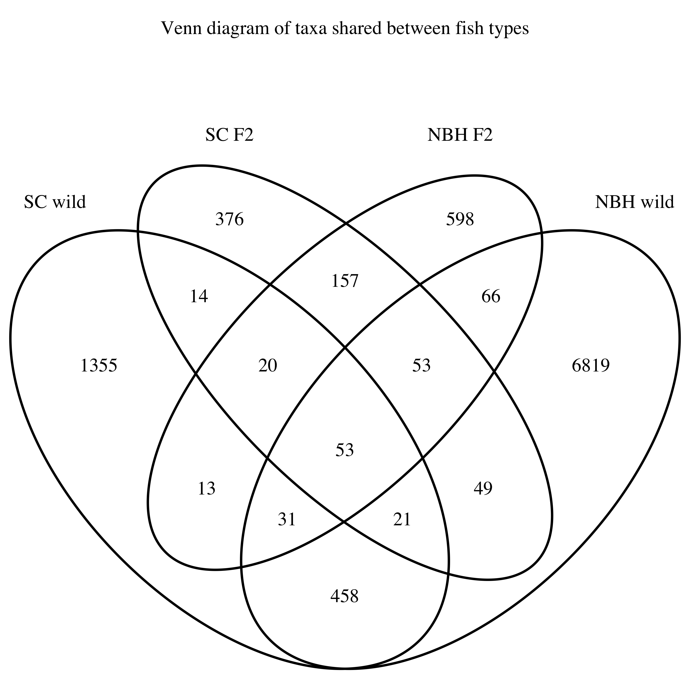

```{r options, echo=FALSE, message=FALSE}
knitr::opts_chunk$set(echo = FALSE, message=FALSE, warning=FALSE, error=FALSE, include=TRUE, fig.width=12, cache=TRUE, collapse=TRUE, autodep=TRUE, fig.path="html_figures/")
knitr::knit_hooks$set(inline = function(x) if(is.numeric(x)){format(x,digits=2)}else{x})
```

```{r libraries, cache=FALSE}
#misc
library(here)

#data manipulations
suppressPackageStartupMessages(library(tidyverse))
library(readr)
library(broom)

#plotting stuff
library(ggplot2)
library(cowplot)
library(patchwork)
library(kableExtra)

#analysis
suppressPackageStartupMessages(library(dada2))
library(phyloseq)
library(speedyseq)
library(decontam)
library(skimr)
library(vegan)
library(VennDiagram)
library(ape)
library(corncob)
library(cluster)
library(corrplot)

source("../code/helpful_functions.R")
```

# Raw reads and preprocessing

```{r raw data, cache=FALSE}
taxonomy <- read.delim(here("output/taxonomy.txt"), "\t", header=TRUE, row.names=1, check.names = FALSE)
asvs <- read.delim(here("output/ASVs.txt"), "\t", header=TRUE, row.names=1, check.names = FALSE)
metadata <- read.delim(here("data/KLF_metadata.csv"), ",", header = TRUE, row.names=1, check.names=FALSE)
tree <- read_tree(here("output/tree.nwk"))
track <- read.delim(here("output/track.tsv"), "\t", header=TRUE, row.names=1, check.names=FALSE)
track <- mutate(track, prop.retained = nochim/reads.in) 

seqtab <- readRDS(here("output/seqtab_nochimeras.rds"))
rownames(seqtab) <- rownames(track)

mock_ref <- getSequences(here("data/HMP_MOCK.v35.fasta"))

ps <- phyloseq(otu_table(as.matrix(asvs), taxa_are_rows=TRUE),
              sample_data(as.data.frame(metadata)),
              tax_table(as.matrix(taxonomy)),
              phy_tree(tree))

ps <- merge_phyloseq(ps, sample_data(track))
metadata <- as(sample_data(ps), 'data.frame')
```

## Raw data / run summary

Making sure that the two sequencing runs are not too different from each other. In general it seems like Run2 had a higher proportion of reads pass filter but not more overall reads
```{r pass filter}
metadata %>% ggplot(aes(x=nochim, y=prop.retained, color=sequencingRun))+geom_point()+labs(x="Reads pass filter", y="Proportion pass filter")
```
## Mock community check
Next we check that the Mock community is well covered in both runs. Mock1 is from Run1 and Mock2 is from Run2. Looks like there's very low contamination of other sequences in the mock samples. However, there is some slight difference in the ordering of mock abundances, but this variation is similar to previous runs. 

```{r mock}
match_mock <- sapply(names(seqtab[1,]), function(x) any(grepl(x, c(mock_ref))))
match_mock <- rownames(taxonomy[match_mock,])
ps_mock <- ps %>% subset_samples(sampleType=="mock") %>% prune_taxa(taxa_sums(.)>0, .) %>% transform_sample_counts(function(x) x/sum(x)) %>% psmelt()
ps_mock <- ps_mock %>% bind_cols(correct=sapply(ps_mock$OTU, function(x) if(x %in% match_mock){return("Correct")}else{return("Wrong")}))

ps_mock %>% select(OTU, sample, Abundance, correct) %>% group_by(sample, correct) %>% summarise(proportion = sum(Abundance)) %>% pivot_wider(id_cols=sample, values_from = proportion, names_from=correct)

ps_mock %>% filter(OTU %in% match_mock) %>% ggplot(aes(x=reorder(OTU, Abundance), y=Abundance, color=Genus)) + geom_point() + facet_wrap(~sample) + theme(axis.text.x = element_text(angle=45)) + labs(x="ASV", y="Relative abundance")
```

Now that mock is checked out, we can remove it from the data.
```{r remove mock}
ps <- ps %>% subset_samples(sampleType != "mock") %>% prune_taxa(taxa_sums(.)>0,.)
```

## Removing contaminant ASVs with decontam

We will use decontam and the negative controls (both extraction negatives and PCR negatives) to filter out potential contaminant sequences by frequency of appearance in the negative controls.

```{r decontam}
sample_data(ps)$is.neg <- grepl("control", sample_data(ps)$sampleType)
contamdf_prev <- isContaminant(ps, method="prevalence", neg="is.neg")
table(contamdf_prev$contaminant)
```

Below is the taxonomy of the ASVs that were identified as contaminants.

```{r decontam taxonomy}
contaminant_asvs <- rownames(contamdf_prev[which(contamdf_prev$contaminant),])
taxonomy[contaminant_asvs,] %>% kable("html") %>% kable_styling(bootstrap_options = "striped")
```

Here's a graph of the ASV prevalence in true vs negative control samples. Highlighted in blue are the ones identified as contaminants. 
```{r decontam graph}
ps.pa <- transform_sample_counts(ps, function(abund) 1*(abund>0))
ps.pa.neg <- prune_samples(sample_data(ps.pa)$is.neg == TRUE, ps.pa)
ps.pa.pos <- prune_samples(sample_data(ps.pa)$is.neg != TRUE, ps.pa)
# Make data.frame of prevalence in positive and negative samples
df.pa <- data.frame(pa.pos=taxa_sums(ps.pa.pos), pa.neg=taxa_sums(ps.pa.neg),
                      contaminant=contamdf_prev$contaminant)
ggplot(data=df.pa, aes(x=pa.neg, y=pa.pos, color=contaminant)) + geom_point() +
  xlab("Prevalence (Negative Controls)") + ylab("Prevalence (True Samples)")
```

## Chloroplasts

I also want to remove the chloroplasts from the samples. However, I want to make a record of the chloroplast abundance in the metadata of the sample, because it may be useful information later. 

```{r chloroplast levels}
ps.chloroplast <- ps %>% transform_sample_counts(function(x) x/sum(x)) %>% subset_taxa(Order=="Chloroplast") %>% psmelt() %>% select(OTU, sample, Abundance)
ps.chloroplast <- ps.chloroplast %>% group_by(sample) %>% summarise(chl_abundance=sum(Abundance)) %>% column_to_rownames("sample")

ps <- merge_phyloseq(ps, sample_data(ps.chloroplast))

ggplot(sample_data(ps), aes(x=reorder(sample, chl_abundance), y=chl_abundance, color=sampleType)) + geom_point() + facet_wrap(~fishType, scales="free_x") + labs(title="Proportion of reads matching Order Chloroplast", x="Sample", y="Chloroplast relative abundance")
```
Removing chloroplasts, contaminants, and non-bacterial/archaeal ASVs
How do the read counts look after we remove the chloroplast samples and the putative contaminants? 

```{r cleaning up}
# remove contaminants
ps <- prune_taxa(!taxa_names(ps) %in% contaminant_asvs, ps)

# remove chloroplasts and Eukaryotess
ps <- subset_taxa(ps, Kingdom!="Eukaryota") %>% subset_taxa(Order!="Chloroplast" | is.na(Order))

# remove controls
ps <- subset_samples(ps, sampleType %in% c("gut", "water")) %>% prune_taxa(taxa_sums(.)>0,.)

# get number and proportion of reads now
sample_data(ps)$reads.clean <- sample_sums(ps)
sample_data(ps)$final.prop <- sample_data(ps)$reads.clean/sample_data(ps)$reads.in
```

## Cleaned up stats

In the table below nochim is the number of raw reads that passed dada2 filtering. prop.retained is the proportion that passed dada2 filtering. reads.clean is the number of reads we currently have and final.prop is the final proportion of reads pass all the filtering (dada2 and what we just did)
```{r read stats}
read_stats <- sample_data(ps) %>% as_tibble() %>% select(sample, nochim, prop.retained, reads.clean, final.prop) %>% skim(where(is.numeric))
tibble(read_stats) %>% kbl("html") %>% kable_styling(bootstrap_options = "striped")
```

The script preprocessing.R will generate the cleaned data that will be used in the subsequent analysis. After this, I will load the preprocessed .rds files


```{r load processed data, cache=FALSE}
# source(here("scripts/preprocessing.R"))
ps <- readRDS(here("data/processed/ps.rds"))
ps.rel <- readRDS(here("data/processed/psrel.rds"))
ps.melted <- readRDS(here("data/processed/psmelted.rds"))
```


# Diversity analysis

## Alpha diversity

Comparing wild and F2 killifish alpha diversity. Black dots represent the water at each site at the time of sampling. Water for the captive killifish is not available. 

```{r alpha, warning=FALSE}
p <- ps %>% subset_samples(sampleType=="gut") %>% plot_richness(x = "site", measures=c("Observed","Shannon","Simpson"))
w <- ps %>% subset_samples(sampleType=="water") %>% plot_richness(x = "site", measures=c("Observed","Shannon","Simpson"))
ggplot(p$data, aes(x=site, y=value, color=wild_or_F2)) + geom_boxplot() + geom_point(data=w$data, aes(x=site, y=value), color="black") + facet_wrap(~variable, scales="free_y") + theme_light() + labs(title="Alpha diversity metrics", y="")
```
### Alpha diversity significance tests

Pairwise t-tests show that NBH wild fish have significantly different diversity values than all other fish types while SC wild, SC F2, and NBH F2 fish have similar measurements. One exception is that SC wild has a higher Simpson measurement than NBH F2. 
```{r}
rich_est <- estimate_richness(ps, measures=c("Observed", "Shannon","Simpson"))

#make into a tibble with relevant columns from metadata
rich_est <- rich_est %>% rownames_to_column(var="sample") %>% left_join(as(sample_data(ps), "data.frame"), by="sample") %>% filter(sampleType=="gut") %>%  select(sample, Observed, Shannon, Simpson, site, fishType) %>% pivot_longer(cols = Observed:Simpson, names_to = "measurement", values_to = "values")

# do pairwise t tests on each alpha diversity measurement type
rich_est_test <- rich_est %>% group_by(measurement) %>% nest() %>% mutate(test = map(.x=data, ~pairwise.t.test(.x$values, .x$fishType) %>% tidy())) %>% select(measurement, test) %>% unnest(cols=c(test)) %>% mutate(significant = p.value < 0.05) %>% ungroup()
```


## Beta dispersion

Subsetting to just the gut samples, now we look at the beta dispersion/diversity between sites and between F2 and wild type

```{r beta dispersion}
ps.rel.gut <- ps.rel %>% subset_samples(sampleType=="gut")
ps.rel.gut.dist <- distance(ps.rel.gut, "bray")
dat <- as(sample_data(ps.rel.gut), "data.frame")

fishType <- dat$fishType
site <- dat$site
wild_or_F2 <- dat$wild_or_F2

# Check the beta dispersion of site X wild_or_F2
disper.fishType <- betadisper(d=ps.rel.gut.dist, group=fishType)
df <- data.frame(disper=disper.fishType$distances,group=disper.fishType$group)
disper_plot<-ggplot(df, aes(x=group, y=disper)) + geom_boxplot(aes(color=group)) + 
  labs(y="Distance from spatial median (dispersion)") +coord_flip() + scale_x_discrete(limits=rev) + 
  theme_light() + theme(axis.title.y.left = element_blank(), legend.position = "none")
disper_plot
```

Tukey's HSD test shows that all pairwise comparisons of beta dispersion between fish types are significantly different except for between the F2 fish. 
```{r tukey HSD}
tuk.fishType <- TukeyHSD(disper.fishType)
tuk.fishType
```

# Ordination 

## PCoA of all samples

I attempted to do an NMDS ordination but `metaMDS` would not converge. So I created a PCoA using Bray-Curtis dissimilarity
```{r pcoa ordinate}
ps.rel.bc <- distance(ps.rel, method="bray")
ps.rel.bc.pcoa <- ordinate(ps.rel, method="MDS", distance=ps.rel.bc)
```

```{r pcoa plot}
p <- plot_ordination(ps.rel, ps.rel.bc.pcoa) + 
  geom_point(aes(color=site, shape=wild_or_F2), size=4) +
  labs(title="PCoA using Bray Curtis Dissimilarity") +
  theme_light()

# coordinates are fixed to the sqrt of the second eigenvalue divided by the first eigenvalue
p + 
  geom_point(data=p$data %>% filter(sampleType=="water"), aes(x=Axis.1, y=Axis.2, color=site), shape="circle", size=4) + 
  scale_color_manual(name="Site", values=c("pink", "blue")) +
  scale_shape_manual(name="Sample/Fish Type", values=c("square", "circle", "triangle"),labels=c("F2", "Water", "Wild")) +
  coord_fixed(sqrt(ps.rel.bc.pcoa$values[,1][2]/ps.rel.bc.pcoa$values[,1][1]))
```

## Ordination of just wild

```{r}
ps_bc_nmds <- ordinate(subset_samples(ps.rel, wild_or_F2=="wild" & sampleType=="gut") %>% prune_taxa(taxa_sums(.)>0,.), distance="bray", "NMDS", trymax=500)
plot_ordination(subset_samples(ps.rel, wild_or_F2=="wild" & sampleType=="gut") %>% prune_taxa(taxa_sums(.)>0,.), ps_bc_nmds) + geom_point(aes(color=site)) + labs(main="NMDS wild fish")
```

## PERMANOVA of wild and F2 fish

Interestingly a PERMANOVA finds that the two F2 populations are significantly different
```{r}
ps.wild.rel <- subset_samples(ps.rel, wild_or_F2=="wild")
ps.f2.rel <- subset_samples(ps.rel, wild_or_F2=="F2")

adonis2(distance(ps.wild.rel, "bray")~ site + weight.g + length.cm, data=as(sample_data(ps.wild.rel), "data.frame"), by="margin")
adonis2(distance(ps.f2.rel, "bray")~ site + weight.g + length.cm + sex, data=as(sample_data(ps.f2.rel), "data.frame"), by="margin")
```

## PCA Biplot

```{r biplot all}
top10 <- prune_taxa(names(sort(taxa_sums(ps.rel), TRUE))[1:9], ps.rel) %>% otu_table()

biplot.pcoa(x=ps.rel.bc.pcoa, t(top10))
```

```{r pcoa wild}
ps.wild <- ps.rel %>% subset_samples(sampleType=="gut" & wild_or_F2=="wild") %>% prune_taxa(taxa_sums(.)>0,.)
ps.wild.bc <-  ps.wild %>% distance("bray")
ps.wild.pcoa <- ordinate(ps.wild, method="MDS", distance=ps.wild.bc)

p <- plot_ordination(ps.wild, ps.wild.pcoa) + 
  geom_point(aes(color=site), size=4) +
  labs(title="PCoA using Bray Curtis Dissimilarity") +
  theme_light()

# coordinates are fixed to the sqrt of the second eigenvalue divided by the first eigenvalue
p + 
  scale_color_manual(name="Site", values=c("pink", "blue"))
  coord_fixed(sqrt(ps.wild.pcoa$values[,1][2]/ps.wild.pcoa$values[,1][1]))
```
within the wild samples, ASV2, ASV3, and ASV5 structure the populations

```{r}
library(factoextra)
top10 <- prune_taxa(names(sort(taxa_sums(ps.wild), TRUE))[1:9], ps.wild) %>% otu_table()
biplot.pcoa(x=ps.wild.pcoa, t(top10))

```

# ASV differences

## Overlap of ASVs

I was curious how many ASVs were unique to each environment/fish type: Scorton Creek wild, New Bedford Harbor wild, and the respective F2 fish

```{r venn}
taxa_list <- list(sc_w = subset_samples(ps, fishType=="Scorton Creek wild") %>% prune_taxa(taxa_sums(.)>0,.) %>% taxa_names(),
                  nb_w = subset_samples(ps, fishType=="New Bedford Harbor wild") %>% prune_taxa(taxa_sums(.)>0,.) %>% taxa_names(),
                  sc_f2 = subset_samples(ps, fishType=="Scorton Creek F2") %>% prune_taxa(taxa_sums(.)>0,.) %>% taxa_names(),
                  nb_f2 = subset_samples(ps, fishType=="New Bedford Harbor F2") %>% prune_taxa(taxa_sums(.)>0,.) %>% taxa_names())

taxa_overlap <- calculate.overlap(taxa_list)

venn.diagram(taxa_list, filename = here("figures/Venn_gut.png"), imagetype="png", main="Venn diagram of taxa shared between fish types", category.names = c("SC wild", "NBH wild", "SC F2", "NBH F2"))
```



```{r overlap percents}
f2 <- calculate.overlap(list(taxa_list$sc_f2, taxa_list$nb_f2))

w <- calculate.overlap(list(taxa_list$sc_w, taxa_list$nb_w))
```

F2 fish share `r 100*length(f2$a3)/length(unique(c(f2$a1,f2$a2)))`% of their ASVs while wild fish share `r 100*length(w$a3)/length(unique(c(w$a1, w$a2)))`% of their ASVs.

## Core taxa - present in all fish types

Core taxa in wild type are either Vibrionaceae or Mycoplasma while core taxa in F2 are Lactobacillales
```{r core microbiome}
ps.core <- prune_taxa(taxa_names(ps.rel) %in% taxa_overlap$a6, ps.rel) %>% subset_samples(sampleType=="gut")
core.plot <- ps.core %>% plot_bar(fill="Order")+ geom_bar(aes(fill=Order), stat="identity", position="stack")+facet_wrap(~fishType, scales="free_x")
core.plot.legend <- get_legend(core.plot+ guides(fill = guide_legend(nrow = 3))+theme(legend.position = "bottom"))
p <- core.plot + theme(legend.position = "none")
plot_grid(p, core.plot.legend, ncol=1, rel_heights = c(1,.2))
```

*Core Lactobacillales ASVs:*

```{r}
ps.core %>% tax_table() %>% as.data.frame() %>% filter(Order=="Lactobacillales") %>% .[,4:7] %>% kbl(format="html")
```


*Core Vibrionales ASVs:*
```{r}
ps.core %>% tax_table() %>% as.data.frame() %>% filter(Order=="Vibrionales") %>% .[,4:7] %>% kbl("html")
```


*Core Mycoplasmatales ASVs:*
```{r}
ps.core %>% tax_table() %>% as.data.frame() %>% filter(Order=="Mycoplasmatales") %>% .[4:7] %>% kbl("html")
```


There are still some of these major groups that are not part of the core that are super abundant in some samples. The following bar chart includes all ASVs from the three main orders, not just the core ASVs. Notice the Lactobacillales that appear in a few of the NBH wild fish and the additional Vibrionales in the SC wild fish. 

```{r vibrio myco and lacto}
ps.subset <- subset_taxa(ps.rel, Order %in% c("Vibrionales", "Lactobacillales","Mycoplasmatales")) %>% subset_samples(sampleType=="gut")
ps.subset %>% plot_bar(fill="Order")+ geom_bar(aes(fill=Order), stat="identity", position="stack")+facet_wrap(~fishType, scales="free_x")
```

### What are the top most abundant orders in killifish guts?

I wanted to know what were the most dominant orders in each fish type. So I found the top 5 average relative abundance of order for each fish type and plotted their abundances. 15 Orders had high average relative abundance in at least one fish type, but some were clearly due to a couple of outlier fish.

```{r fifteen top orders}
# in psmelt, group by Order and fishType and summarise average relative abundance, taking the top 5 from each fish type
top5_order <- ps.melted %>% filter(sampleType=="gut") %>% group_by(Order, fishType) %>% summarise(mean_relAbund = mean(abund_rel)) %>% group_by(fishType) %>% top_n(5, mean_relAbund) %>% pull(Order)

# glom ps by order and transform to relative abundance, then melting again
ps_top5order_melt <- ps %>% tax_glom("Order") %>% transform_sample_counts(function(x) x/sum(x)) %>%  psmelt() %>% filter(Order %in% top5_order & sampleType=="gut")

# plotting all 15 top Orders
ps_top5order_melt %>% ggplot(aes(x=fishType, y=Abundance)) + geom_boxplot(outlier.shape = NA) + geom_jitter(aes(color=fishType), height = 0, width=.2) + facet_wrap(~Order, scales="free")

```

I removed those orders in which only a few fish showed high relative abundance. Now the number of orders is down to 5 and it's much easier to interpret. Wild fish are dominated by Vibrio and Mycoplasmatales while F2 fish are dominated by Lactobacillales and somewhat by Clostridiales and Cyanobacteriales. I found it interesting that SC wild fish have huge amounts to Vibrio but also huge amounts of Myco, while NBH wild just has a variable amount of vibrio and a small amount of myco. I wonder if the Myco and Vibrio in SC are negatively correlated. For more, see the vibrio section.

```{r five top orders}
# better plot with the clear outlier orders removed
ps_top5order_melt %>% filter(Order %in% c("Vibrionales", "Mycoplasmatales", "Lactobacillales", "Clostridiales", "Cyanobacteriales")) %>% ggplot(aes(x=fishType, y=Abundance)) + geom_boxplot(outlier.shape = NA) + geom_jitter(aes(color=fishType), height = 0, width=.2) + facet_wrap(~Order, scales="free")
```

## Prevalence and abundance

TBD

## Differentially abundant ASVs

**Differentially abundant ASVs between wild and F2**
```{r corncob wild f2, cache=TRUE}
# filter by gut only, and remove ASVs with fewer than 20 reads
# first remove ASVs that never have more than 20 reads
ps.abund <- ps %>% subset_samples(sampleType=="gut") %>% prune_taxa(taxa_sums(.)>20, .)
da_wild_f2 <- differentialTest(formula = ~wild_or_F2,
                               phi.formula = ~wild_or_F2,
                               formula_null = ~1,
                               phi.formula_null = ~wild_or_F2,
                               test="Wald", boot=FALSE,
                               data=ps.abund,
                               fdr_cutoff = 0.05)
da_wild_f2_clean <- cleanDA(da_wild_f2, "wild_or_F2")

p <- ggplot(filter(da_wild_f2_clean, variable!="Intercept"), aes(x=Estimate, y=reorder(str_c(ASV, " ", Taxonomy), Estimate, decreasing=TRUE))) + 
  geom_vline(xintercept = 0, color = "gray50", lty = "dashed", alpha = 0.75, lwd = 1) +
  geom_point() +
  geom_errorbarh(aes(xmin = Estimate-1.96*StdE, xmax = Estimate+1.96*StdE), height = .3) +
  theme_light() +
  facet_wrap(~variable, scales = "free_x", nrow = 1) +
  labs(title = "", x = "", y = "Taxa") +
  scale_y_discrete(limits = rev) +
  scale_x_continuous(breaks = scales::pretty_breaks(n = 5)) +
  theme(axis.text.x = element_text(angle = 45, hjust = 1))
p + labs(title="Differentially enriched taxa in wild vs F2 fish")
```

**Differentially abundant taxa between F2 SC and NBH fish**
```{r corncob NBH SC f2, cache=TRUE}
ps.f2.abund <- ps %>% subset_samples(wild_or_F2=="F2" & sampleType=="gut") %>% prune_taxa(taxa_sums(.)>20, .)
da_site_f2 <- differentialTest(formula = ~site,
                               phi.formula = ~site,
                               formula_null = ~1,
                               phi.formula_null = ~site,
                               test="Wald", boot=FALSE,
                               data=ps.f2.abund,
                               fdr_cutoff = 0.05)
da_site_f2_clean <- cleanDA(da_site_f2, "site") %>% filter(variable!="Intercept")

r <- ggplot(da_site_f2_clean, aes(x=Estimate, y=reorder(str_c(ASV, " ", Taxonomy), Estimate, decreasing=TRUE))) + 
  geom_vline(xintercept = 0, color = "gray50", lty = "dashed", alpha = 0.75, lwd = 1) +
  geom_point() +
  geom_errorbarh(aes(xmin = Estimate-1.96*StdE, xmax = Estimate+1.96*StdE), height = .3) +
  theme_light() +
  facet_wrap(~variable, scales = "free_x", nrow = 1) +
  labs(title = "", x = "", y = "Taxa") +
  scale_y_discrete(limits = rev) +
  scale_x_continuous(breaks = scales::pretty_breaks(n = 5)) +
  theme(axis.text.x = element_text(angle = 45, hjust = 1))
r + labs(title="Differentially enriched taxa between F2 SC and wild NBH fish")
```


**Differentially abundant ASVs between NBH wild and SC wild**
```{r corncob NBH SC wild, cache=TRUE}
ps.wild.abund <- ps %>% subset_samples(wild_or_F2=="wild" & sampleType=="gut") %>% prune_taxa(taxa_sums(.)>20, .)
da_site_wild <- differentialTest(formula = ~site,
                               phi.formula = ~site,
                               formula_null = ~1,
                               phi.formula_null = ~site,
                               test="Wald", boot=FALSE,
                               data=ps.wild.abund,
                               fdr_cutoff = 0.05)
da_site_wild_clean <- cleanDA(da_site_wild, "site") %>% filter(variable!="Intercept")

q <- ggplot(da_site_wild_clean, aes(x=Estimate, y=reorder(str_c(ASV, " ", Taxonomy), Estimate, decreasing=TRUE))) + 
  geom_vline(xintercept = 0, color = "gray50", lty = "dashed", alpha = 0.75, lwd = 1) +
  geom_point() +
  geom_errorbarh(aes(xmin = Estimate-1.96*StdE, xmax = Estimate+1.96*StdE), height = .3) +
  theme_light() +
  facet_wrap(~variable, scales = "free_x", nrow = 1) +
  labs(title = "", x = "", y = "Taxa") +
  scale_y_discrete(limits = rev) +
  scale_x_continuous(breaks = scales::pretty_breaks(n = 5)) +
  theme(axis.text.x = element_text(angle = 45, hjust = 1))
q + labs(title="Differentially enriched taxa between wild SC and wild NBH fish")
```

### Abundance of significant taxa in the seawater

Are these taxa just enriched in the seawater of the respective sites? Only a small fraction of the significant ASVs are more abundant in SC water if they were enriched in the guts or less abundant in SC water if they were depleted in guts. 
```{r sig water}
sig_water <- ps.rel %>% prune_taxa(taxa_names(ps.rel) %in% da_site_wild_clean$ASV,.) %>% subset_samples(sampleType=="water") %>% psmelt() %>% rename(ASV="OTU") %>% left_join(da_site_wild_clean[,1:6], by="ASV")
ggplot(sig_water, aes(x=Abundance, y=reorder(str_c(ASV, " ", Taxonomy), Estimate, decreasing=TRUE), shape=site)) +
  scale_y_discrete(limits=rev) +
  geom_point(aes(color=ifelse(Estimate>0, "red", "green"))) + scale_x_log10() +
  labs(y="signifiant taxa", title="Abundance of significant taxa in SW") +
  scale_color_manual(labels=c("no", "yes"), values=c("red", "blue")) + guides(color=guide_legend(title="enriched in SC"))
```
```{r sig water table}
sig_water <- sig_water %>% select(ASV, site, Estimate, Taxonomy, Abundance, Sample) %>% mutate(SC_enriched = Estimate >0) %>% group_by(ASV, site) %>% summarise(avg=mean(Abundance), SC_enriched = SC_enriched, Taxonomy=Taxonomy) %>% distinct() %>% pivot_wider(id_cols=c(ASV,site, SC_enriched, Taxonomy), names_from=site, values_from=avg) %>% mutate(expected = ifelse(SC_enriched, ifelse(`Scorton Creek` > `New Bedford Harbor`, "yes", "no"),ifelse(`New Bedford Harbor` > `Scorton Creek`, "yes", "no")))
sig_water <- rename(sig_water, NBH_abund="New Bedford Harbor", SC_abund = "Scorton Creek")
sig_water[order(sig_water$expected),] %>% kbl("html") %>% kable_styling(bootstrap_options = "striped")
```

# Vibrionales

In the core taxa section, I found that Vibrionales is highly abundant in wild fish, and particularly in Scorton Creek wild fish. In the differential abundance analysis, I found that it's a specific vibrio ASV (ASV2) that is enriched in SC fish (both wild and F2) while NBH wild fish are enriched in different vibrio taxa. I think this difference warrants further investigation.

## Vibrionales differences between the wild fish

I looked at the overlap in vibrio ASVs between the two fish populations. 

```{r}
ps_vibrio <- ps %>% subset_samples(sampleType=="gut" & wild_or_F2=="wild") %>% subset_taxa(Order=="Vibrionales") %>% prune_taxa(taxa_sums(.)>0,.)

taxa_list <- list(
  SC = subset_samples(ps_vibrio, fishType=="Scorton Creek wild") %>% prune_taxa(taxa_sums(.)>0,.) %>% taxa_names(),
  NBH = subset_samples(ps_vibrio, fishType=="New Bedford Harbor wild") %>% prune_taxa(taxa_sums(.)>0,.) %>%  taxa_names())

overlap <- calculate.overlap(taxa_list)
```

Scorton Creek fish have `r length(overlap$a1)` Vibrio ASVs, New Bedford fish have `r length(overlap$a2)` Vibrio ASVs, and they share `r length(overlap$a3)` Vibrio ASVs. For clarity, I only plotted the ASVs which ever reach a relative abundance above 1%. In SC ASV2 is dominant, but in NBH ASV2 and ASV5 are about equally dominant

```{r vibrio overlap}
ps_vibrio_overlap <- ps_vibrio %>% transform_sample_counts(function(x) x/sum(x)) %>% filter_taxa(function(x) any(x>0.01), prune=TRUE) %>% psmelt() %>% filter(OTU %in% overlap$a3)

shading <- tibble(OTU = unique(ps_vibrio_overlap$OTU)) %>% mutate(min=seq(from=.5, to=max(as.numeric(as.factor(OTU))), by=1), max=min+1, col=rep(c(0,1), length.out=length(min)))

p <- ps_vibrio_overlap %>% ggplot() + geom_boxplot(aes(x=Abundance, y=reorder(OTU, Abundance), color=site)) + geom_rect(data=shading, aes(ymin=min, ymax=max, xmin=-Inf, xmax=Inf, fill=factor(col)), alpha=0.2) + scale_fill_manual(values=c("white", "gray53")) + theme_bw() + guides(fill="none") + theme(legend.direction = "horizontal", legend.position = "bottom") + labs(y="", x="Relative abundance", main="Vibrio ASVs in wild fish")

p
```

## Tree of Vibrios

```{r vibrio tree}

library(ggtree)

vibrio_tree <- phy_tree(tree) %>% merge_phyloseq(ps_vibrio) %>% transform_sample_counts(function(x) x/sum(x)) %>% filter_taxa(function(x) any(x>0.01), prune=TRUE) %>% phy_tree() %>% ggtree(ladderize = F) + geom_tiplab(aes(label=label))
vibrio_tree
```
## Vibrio corrplot 

```{r vibrio corrplot}
v_otu <- ps_vibrio %>% transform_sample_counts(function(x) x/sum(x)) %>% filter_taxa(function(x) any(x>0.01), prune=TRUE) %>% otu_table() %>% t() %>% as.data.frame()
corrplot(cor(v_otu[,rev(vibrio_tree$data$label[1:46])]))
```

# Microbial co-occurence networks

TBD

## In wild fish

I found that SC fish had high abundances of both vibrios and mycoplasmatales and wondered if they were negatively correlated overall and if Vibrio and Mycoplasmatales collectively structure wild (or just SC) gut microbiomes. 

## In F2 fish

```{r, eval=FALSE}
library(SpiecEasi)
spiec.easi(ps.wild.abund)
ps_wild_abund <- subset_samples(ps, sampleType=="gut" & wild_or_F2 == "wild") %>% prune_taxa(names(sort(taxa_sums(.),TRUE))[1:20],.)
tax_dist <- ps_wild_abund %>% otu_table() %>% as.data.frame() %>% vegdist("jaccard")
wild_net <- make_network(ps_wild_abund, "taxa", distance=tax_dist, keep.isolates = TRUE, max.dist = 0.9)
wild_metadata <- as(sample_data(ps_wild_abund),"data.frame")
wild_otudata <- as(tax_table(ps_wild_abund), "data.frame") %>% rownames_to_column(var="ASV") %>% mutate(taxname=str_c(ASV,"_",Taxonomy))
V(wild_net)$taxname <- wild_otudata[which(wild_otudata$ASV==names(V(wild_net))),"taxname"]
V(wild_net)$Order <- wild_otudata[which(wild_otudata$ASV==names(V(wild_net))),"Order"]
#V(wild_net)$sample <- wild_metadata[names(V(wild_net)),"sample"]
netg <- ggnetwork(wild_net)

ggplot(netg, aes(x = x, y = y, xend = xend, yend = yend)) +
  geom_edges(color = "darkgray") +
  geom_nodes(aes(color=Order)) + 
  geom_nodelabel(aes(label=taxname))+
  theme_blank()
```

```{r, eval=FALSE}

# Want a heat map where samples are cluster by BC distance, Taxa (just the significant ones) are clustered by phylogeny, and the color is the abundance of that taxa
```

## Host AHR genotype distributions

Let's look at the distribution of host genotypes. I think it's interesting that the distribution of genotypes is so similar for the wild fish but different in the F2 that were common garden raised. Fish with genotype "none" did not have a band wither either set of primer. I have re-extracted DNA and re-run the primers for the wild fish, which decreased the number of "none" genotypes, but have not done so yet for the F2 fish, hence the greater number of "none" fish in F2. 

```{r host genotypes}
ggplot(metadata %>% filter(!is.na(genotype) & sampleType=="gut"), aes(x=genotype)) + geom_bar(position="stack") +facet_wrap(~fishType) + labs("Distribution of genotypes before removing high chloroplast fish") + geom_text(stat='count', aes(label=..count..), vjust=1, color="yellow")
```

## Wild fish microbiome correlation with AHR genotype

Not looking great visually
```{r ahr bc}
ps.rel.filtered <- ps.rel %>% subset_samples(wild_or_F2=="wild" & sampleType=="gut" & genotype != "none") %>% prune_taxa(taxa_sums(.)>0,.)
p.ord <- ordinate(ps.rel.filtered, method="NMDS", distance = "bray", trymax=500)
plot_ordination(ps.rel.filtered, p.ord, color="genotype") + labs(title="BC NMDS")
```

Permanova confirms no correlation 
```{r ahr permanova}
p.bc <- distance(ps.rel.filtered, "bray")
genotype <- sample_data(ps.rel.filtered)$genotype

adonis2(p.bc ~ genotype, as(sample_data(ps.rel.filtered),"data.frame"))
```